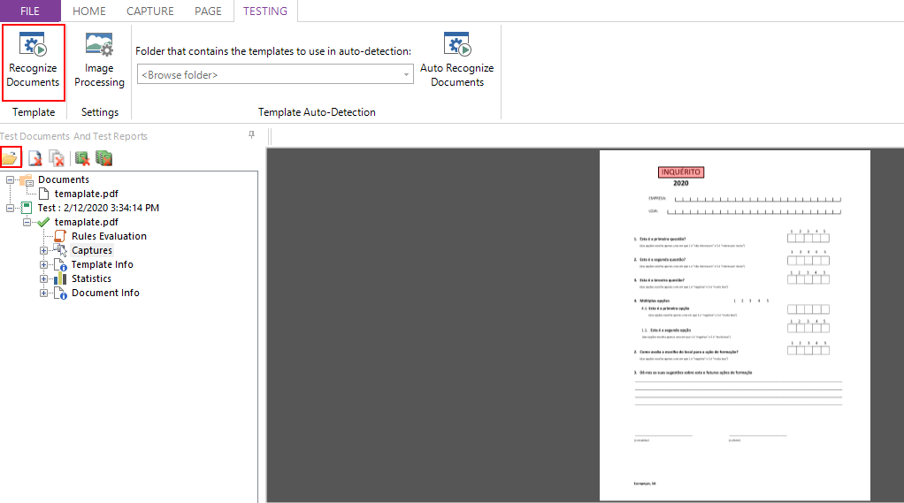

[***View the Project on GitHub***](https://github.com/DevScope/ocr-smartdocumentor)
***DevScope/ocr-smartdocumentor***

# Technical Documentation


|  #Version        | Date             | Changes          | Author          |
| ---------------- |:----------------:|:----------------:|:---------------:|
| V 1.0            | 17-02-2020       | Initial Document |Luís Maia        |

                                          

**Contacts**


| DevScope | João Sousa                 |
| ---      | ---                        |
|          | <joao.sousa@devscope.net>  |
|          | +315 966 380 757           |


Copyright © DevScope

All information in this document is confidential and for the exclusive access of SmartDocumentor customers.
Access to this document is not permitted to any other entity without prior from DevScope. 
Any entity with access to this document, is obliged to the confidentiality of the same.

Index
=====

[1. Introduction ](#introduction)

[1.1 Overview ](#overview)

[1.1.1 Scanning - Scan Station ](#scanning---scan-station)

[1.1.2 Processing - Process Station ](#processing---process-station)

[1.1.3 Review - Review Station ](#review---review-station)

[1.1.4 Templates - Template Editor ](#templates---template-editor)

[1.1.5 Management - Management Station
](#management---management-station)

[1.1.6 SmartDocumentor's Assumptions ](#smartdocumentors-assumptions)

[1.1.7 Workflow ](#workflow)

[1.2 Extensibility and future versions
](#extensibility-and-future-versions)

[2. Customize SmartDocumentor ](#customize-smartdocumentor)

[2.1 Client Configuration ](#client-configuration)

[2.1.1 Service Configuration ](#service-configuration)

[2.1.2 Storage Configuration ](#storage-configuration)

[2.1.3 Plafond ](#plafond)

[2.2 Workflow ](#workflow-1)

[2.2.1 Workspace.config.xml ](#workspace.config.xml)

[2.2.2 Local Vs Global ](#local-vs-global)

[2.2.3 Scan Station ](#scan-station)

[2.2.4 Review Station ](#review-station)

[2.2.5 Process Station ](#process-station)

[2.3 Project Structure ](#project-structure)

[2.4 Workers ](#workers)

[2.4.1 SmartDocumentor ](#smartdocumentor)

[2.4.2 Custom Worker ](#custom-worker)

[2.5 Plugins ](#plugins)

[2.5.1 Scan Plugin ](#scan-plugin)

[2.5.2 Review Plugin ](#review-plugin)

[2.6 Debug ](#debug)

[3. Installation ](#installation)

[3.1 Checklist ](#checklist)

[3.1.1 Requirements ](#requirements)

[3.1.2 Firewall and Antivirus Exclusions (Servers & Clients)
](#firewall-and-antivirus-exclusions-servers-clients)

[3.2 Server Installation ](#server-installation)

[3.2.1 Install Setup ](#install-setup)

[3.2.2 Change the user running the windows service
](#change-the-user-running-the-windows-service)

[3.2.3 Copy the customized configuration
](#copy-the-customized-configuration)

[3.2.4 Configure the configuration path
](#configure-the-configuration-path)

[3.2.5 Extract the HDI to generate the license
](#extract-the-hdi-to-generate-the-license)

[3.2.6 Activate SmartDocumentor license
](#activate-smartdocumentor-license)

[3.2.7 Activate SmartDocumentor Plafond
](#activate-smartdocumentor-plafond)

[3.3 Review and Scan Station Installation
](#review-and-scan-station-installation)

[3.3.1 Install Setup ](#install-setup-1)

[3.3.2 Copy the customized configuration
](#copy-the-customized-configuration-1)

[3.3.3 Configure the configuration path
](#configure-the-configuration-path-1)

[3.3.4 Extract the HDI to generate the license
](#extract-the-hdi-to-generate-the-license-1)

[3.3.5 Activate SmartDocumentor license
](#activate-smartdocumentor-license-1)

[3.4 Update SmartDocumentor ](#update-smartdocumentor)

[3.5 Update SmartDocumentor Plugin ](#update-smartdocumentor-plugin)

[4. Troubleshooting Overview ](#troubleshooting-overview)

[4.1 Introduction ](#introduction-1)

[4.2 Log folder ](#log-folder)

[4.3 Database ](#database)

[4.3.1 Tables ](#tables)

[4.3.2 Queue States ](#queue-states)

[4.3.3 SmartDocumentor Task XML ](#smartdocumentor-task-xml)

[4.3.4 Documents in Tasks ](#documents-in-tasks)

Introduction
============

Overview
--------

SmartDocumentor is a product developed entirely by DevScope which allows
for intelligent document data capture. The data capture follows the
highest standards, using protocols such as Barcode, OCR (recognition of
printed text), OMR (brand recognition), and even ICR (for recognition of
hand-printed text).

SmartDocumentor is an adaptable software solution to any business, with
a high level of performance and integration of information, which
dramatically reduces the need to provide data on business processes and
allows the focus to be put on management and strategic decision making.


Our solution consists of 5 separate modules that can be installed in a
distributed way (Process Station, Scan Station, Review Station, Template
Editor and Management Station)

The documents interpreted by the system are stored in the PDF Double
Layer format which:

-   Allows to create a file of PDF + Text from images

-   Using Optical Character Recognition (OCR) engines, it adds an
    invisible layer of searchable text document

-   Maintains the initial appearance of the document.

This way it allows the use of standard read-only format and yet capable
of being interpreted by most search engines and therefore indexable and
searchable.

### Scanning - Scan Station

The Scan Station module is usually associated with the document scanning
process. In this component, there is the possibility of recognition of
documents stored in a folder, by specifying the file for recognition or
by enabling the recognition directly from the scanner.

-   Viewing images - Allows the visualization of full-size images, to
    ensure quality control, and in portrait mode, to validate the number
    of pages per document.

-   Scanner setup - Allows the configuration of all the settings related
    to the scanner.

-   Document division - Allows the division of documents, becoming
    relevant in situations in which the pages are sent to the Review
    Station and, even though are part of the same batch, belong to a
    different set of applications.

-   Automatic document separation -- Allows, at the time of the
    scanning, recognition of barcodes and separators, for automatic
    document separation. The use of barcodes also allows to
    automatically classify the documents.


#### Usage 

Scan Station allows to set specific configurations when importing files.
The most common usage is by defining settings and saving them as scanner
profile.

Select the workspace you want to configure and select **From Scanner,**
this will allow to configure a new profile.

1.  Select the Scanner that will be used as input.

2.  Set if you want to use **Ignore Blank** Pages or **Enable
    separation**


3.  Check in the separator **Pages Color** if you need to change the
    color format that will be used when scanning. By default, it is set
    to convert all images to binary (Black and white).

> The **conversion settings** can be used to improve scanning results,
> like remove color patterns or improve the text quality.
>
> 
4.  In the separator **Page Processing,** it is available a set of
    options that allow a more granular configuration.

-   **Page Orientation:** is set to use the scanner result, but it is
    also possible to use a model to rotate the document automatically or
    to manually set a rotation.

-   **Auto Deskew:** helps to align text.

-   **Clean Black Borders:** will remove black lines or areas that are
    common when digitalizing documents.

-   **Auto Invert**: If a document contains large portions of white text
    on black background this will invert the document to make it
    readable for OCR.

-   **Auto Crop**: It will remove automatically black region around the
    text.

-   **Text Thickness:** allows to thicken the text for readability.

-   **Noise Removal:** Remove noise in the document, when set to small
    sensibility can remove text or features that may be important to the
    document.

5.  **Save Settings to a Scanner Profile** will save the configurations
    in the local machine and make it available in the list of profiles.


Select the scanner profile and do **Start Scanning.** The documents will
be imported, converted and displayed in the View area. From here it is
possible to do additional editions on the **Edit** separator.


Finally Send the documents for processing by selecting the separator
Send and then the button **Send All.**

### Processing - Process Station

The Process Station aims to work in parallel with the scanning module,
with the distinct point of having no visible \"interface\" to the user.
This is the central process responsible for processing the scanned
information, either by optical recognition of contents or by mechanisms
of OCR (Optical Character Recognition), OMR (Optical Mark Recognition)
and ICR (Intelligent Character Recognition).

When installed SmartDocumentor will start SmartDocumentor ProcessStation
service. We always need to check if the service is running.


### Review - Review Station

The Review Station aims primarily to confirm that the extracted
information has the required quality/value. Thus, the set of values
possible to extract from the document is presented to the user in a way
it is visually possible to validate in terms of integrity and accuracy.
The user can also decide the final destiny of the document, if relevant
to the process.

In the Review Station, processes will be distributed by each of the
operators that are available. Documents that where processed will show
the captured information in the correspondent field boxes. Review
Station can have custom plugins that will allow specific validations and
field naming. Fields can be of the type text box, drop box or check box.


#### Usage

Review Station is used to validate values and document outputs, it is
possible to remove a document and even, if configured, to re-process.

Select the workspace you want to review the documents, SmartDocumentor
will automatically display documents that are ready for reviewing. It is
possible to see documents that are ready to review in the top bar.


The fields can be navigated using tab key. When selecting a field from
the form, if the field was already detected, the viewer will display a
box around the detected area with the field name and the value to be
sent to the task.

When completing the values in the form, it is possible to write the
values directly on the form boxes or by selecting the text on the
document image. Fields that will be sent to the learning API must be
selected in the image so that the information of the position can be
captured.

After review just press **Process** and the next document will be
presented.

### Templates - Template Editor

The Template Editor allows the user to configure a template that doesn't
requires learning, it can be by default for every document to be
processed within the workspace or with template matching rules, for
different types of documents.

Template editor is tool for facilitating the information's extraction
and especially useful in form type documents.


#### Usage

From the **Home** section, first we must do **Add**, to create the base
for the template, template editor will take any document in the format
tif, jpg, bmp, gif, png or pdf. Template editor will always binarize the
image.


Changing to section **Capture** will make possible to mark areas to
extract. For text extraction is possible to select **OCR** -- for
digital text recognition, **ICR** -- for handwritten text, or **Table
OCR** -- for multiple fields with digital text.


Apart from the most obvious options **OMR Grid** may be used for
multiple choice check box.

The Capture Properties, in the right bottom, will change with the type
of capture that is being drawn.


**Edit Properties** will be available of the **OCR**, **ICR** and
**Barcode** captures, this pane will allow to set additional
configurations for each field and even test the result from the
extraction.

In addition to setting a template for a workspace it is possible to set
Template Match Rules, which defines, from the pre-set captures, the ones
that match a statement as being the correspondent. It is possible to use
conditional operators to improve results.


Finally, template editor allows to test visually the outcomes of a
template, this may be used from the Testing section.



To test a document, just select the folder icon and choose the documents
to recognize. To see the outcome just press **Recognize Documents.** If
using templates with matching rules, it is possible to select the folder
in the filed next to the **Auto Recognize Documents** and then press the
button to see the matching documents results.

### Management - Management Station

Managing workspaces and workflows is a simple task within
SmartDocumentor, as it is based in folders structure and a
pre-structured workspace file. Still to help visualize and manage the
workspaces it is possible to use Management Station.


### SmartDocumentor's Assumptions

In terms of recognition and processing engines, SmartDocumentor has the
following constraints:

-   Only recognizes documents whose input format is: PDF, TIFF, BMP,
    PNG, JPEG or GIF.

-   To be recognized successfully, it is necessary to scan documents
    with good quality considering that they must be legible and have a
    quality of no less than 300 dpis. The characters contained in it
    must be clearly defined and seamless, without any cuts, color
    variations or shades, torn and/or the page must be scanned without
    spots or dirt.

-   Because this parameter is dependent on the type of hardware where
    SmartDocumentor is installed, it is defined that any document fed to
    the system must be a maximum of 50 Mb in size.

-   It is considered that the OCR engine recognizes and extracts data
    with a guaranteed confidence level of 95%, provided that the above
    points are met.

SmartDocumentor' s automatic recognition only identifies the documents
automatically if a template for the document being analyzed has been set
in advance. The process of document automatic identification has a
guaranteed 95% reliability given that the template has been set
correctly. If the document is new (no template), or has not been
recognized automatically, the process of identification and extraction
of data will have to be done manually using the Review Station.

### Workflow

#### Overview

SmartDocumentor is state based and its components allow the processes to
happen in different machines. The most common cases SmartDocumentor has
a server machine for processing the documents and one or several
machines for reviewing - clients. The next image shows a common example
for a workflow.


#### Description

1.  Scan Station

    a.  Reads the images from the Scanner and save them on a temporary
        folder: *%appdata%\\Devscope\\SmartDocumentor\\LocalDB*

    b.  After the user clicks "Send All", a task for each document is
        created on the database and a .tiff file is created on the
        documents storage

2.  Process Station

    a.  The Process Station is waiting for tasks with Queue equal
        "ToProcess".

    b.  In this step, the document is read from SDDocs folder. Fields
        like the barcode are extracted and stored in the XML of the Task
        in the database.

3.  Review Station

    a.  The Review Station is waiting for tasks with Queue equal
        "ToReview".

    b.  In this step, the documents are classified by the user, and the
        information is stored in the XML of the Task in the database.

4.  Process Station

    a.  The second step of the Process Station is waiting for tasks with
        Queue equal "ToIntegrate". In this step, the .jpg images or pdfs
        and XML can be integrated into SharePoint or other custom
        systems.

    b.  After that, the record is moved from the Task table to
        TaskHistory table. The documents will also be moved from SDDocs
        to SDDocs Processed folder.


Extensibility and future versions
---------------------------------

We can extend SmartDocumentor by adding plugins at Scan and Review
Station level. We can also create workers that run on SmartDocumentor's
workflow.

These plugins are independent of the SmartDocumentor product version.
For new releases of SmartDocumentor, the backward combability is kept.

The version number also differ from the plugin and from the product
version.

For each project, it is possible to create/customize a review plugin,
scan plugin and any number of workers.

When a fix/change/improvement is done over the plugin, it is not
necessary to update the SmartDocumentor's setup. Only the plugin files
are necessary to update on the client/server computers.

New SmartDocumentor versions will be combability with the same version
of the plugin. Only in very specific cases the plugin version depends
directly on one SmartDocumentor version. So far, we don't have any
limitation/restriction at this level. Thus, new SmartDocumentor versions
will be possible be installed.

Customize SmartDocumentor
=========================

Client Configuration
--------------------

Client configuration starts by defining a directory which contains the
workspaces for the full process, from receiving documents to saving or
integrating its output.

The root directory must contain the service configuration and the
storage configuration, this folder has been nominated as SDConfig. This
folder must be always accessible and is a shared folder in the network.

Below we show an example of a SDconfig folder, the structure for each
file will be approached in the following sections.


2‑1 SDConfig example folder

Inside the folder Workspaces it is possible to set one or many
workspaces. Each workspace has a different name and
**workspace.config.xml**, this workflow will be approached in the 2.2
Workflow section.

### Service Configuration

Service configuration it was used to for configuring custom notification
services. Currently, it's not used and its stored for compatibility with
legacy SmartDocumentor configurations.

Example of service.config.xml:
```{=html}
1. <?xml version="1.0"?>
2. <Service xmlns:xsi="http://www.w3.org/2001/XMLSchema-instance" xmlns:xsd="http://www.w3.org/2001/XMLSchema">
3. <ServiceList>
4. <ServiceItem Type="Notification" UseService="False" Server="" Port="" UserCurrentCredentials="True" UserName="" Password="" />
5. <ServiceItem Type="MetadataSearch" UseService="False" Server="" Port="" UserCurrentCredentials="True" UserName="" Password="" Index="" IndexType="" />
6. <ServiceItem Type="LogTrackingSerach" UseService="False" Server="" Port="" UserCurrentCredentials="True" UserName="" Password="" Index="" IndexType="" />
7. </ServiceList>
8. </Service>
```

### Storage Configuration 

Storage configuration it's a structural component of SmartDocumentor
workflow. The file must include always the configuration to the folder
were the input documents are stored (**Docs**), as well as the
configurations for the tasks (**Tasks**), most common an SQL database.

Mandatory attributes are:

6.  **ID**: workspace name followed by the tag (Docs, Tasks,
    Docs\_History)

7.  **ConnectionString**: define provider parameters needed as: path,
    credentials mode, authentication protocol. In the case of SQL
    provider also: SQL data source, SQL initial catalog, SQL integrated
    security and SQL provider.

Example of storage.config.xml:
```{=html}
1.	<?xml version="1.0"?>
2.	<Storage xmlns:xsi="http://www.w3.org/2001/XMLSchema-instance" xmlns:xsd="http://www.w3.org/2001/XMLSchema">
3.	  <StorageList>
4.	    <StorageItem ID="DemoInvoice Docs" ConnectionString="Provider=sdfilesystem;Path=C:\devscope\DemoInvoice\SDDocs\Faturas;CredentialsMode=None;AuthProtocol=NTLM" />
5.	    <StorageItem ID="DemoInvoice Tasks" ConnectionString="Provider=sdsql;CredentialsMode=None;AuthProtocol=NTLM;sql_data source=.;sql_initial catalog=SmartDocumentorDemoInvoice;sql_integrated security=True;sql_provider=System.Data.SqlClient" />
6.	  </StorageList>
7.	</Storage>
```

### Plafond

The plafond is set per project, and it\'s common to all client machines.
The file is not editable and if touched will create a special signature
that will block the access to the services. The Plafond.lic file is
stored once, usually in the server machine under the SDConfig folder and
is read by every client's machine, changing the plafond value each time
a document passes through SmartDocumentor.

Workflow
--------

To SmartDocumentor the workflow is the set of folders and files under
Workspaces folder plus the plugins and the workers that are set in the
configuration. This may contain one or many workspaces with
configurations, and if applicable a folder with the templates.

Next, we will explain the configurations, how they interact with
SmartDocumentor and with the client's plugins. For each workspace, there
is a **workspace.config** file.

### Workspace.config.xml
```{=html}
1.	<Workspace xmlns:xsi="http://www.w3.org/2001/XMLSchema-instance" xmlns:xsd="http://www.w3.org/2001/XMLSchema" ID="Devscope_DemoInvoice">
2.	  <Name>Invoice Demo</Name>
3.	  <Description>Invoice Demo</Description>
4.	  <TaskStorage>DemoInvoice Tasks</TaskStorage>
5.	  <DocStorage>DemoInvoice Docs</DocStorage>
6.	  <LocalDocStorage>LocalDocs</LocalDocStorage>
7.	  <LocalTasksPath>LocalTasks</LocalTasksPath>
8.	  <TaskPromotedPropertyList />
9.	  <WorkstationConfigList>…</WorkstationConfigList>
43.	  <PipelineList>…</PipelineList>
266.	 <SettingList />
267. </Workspace> 
```

 In the upper example of a workspace.config file its possible to be seen
a minimized version where the highlighted parts are the recommended to
be changed for each client workspace. The other main regions are
**WorkstationConfigList** and **PipelineList**.

In the **WorkstationConfigList** we configure **ScanStation** and
**ReviewStation** proprieties. The **ScanStation** normally does not
have the need to be changed.

```{=html}
10.	  <WorkstationConfigList>
11.	    <WorkstationConfig Target=" WorkstationConfigList ">
12.	      <CustomPropertyEditorList>
13.	        <CustomPropertyEditor Context="TaskEdit">
14.	          <Title>Default Properties</Title>
15.	<Type>SmartDocumentor.Core.PropertyEditors.GenericScanPropertyEditor</Type>
16.	          <Tooltip>Generic Property Editor</Tooltip>
17.	          <PropertyList />
18.	        </CustomPropertyEditor>
19.	      </CustomPropertyEditorList>
20.	      <CustomComponent />
21.	    </WorkstationConfig>
22.	    <WorkstationConfig Target="ReviewStation">
23.	      <CustomPropertyEditorList>
24.	        <CustomPropertyEditor Context="TaskEdit">
25.	          <Title>Invoice Fields</Title>
26.	          <Assembly>SmartDocumentor.GenericPlugin.Demo</Assembly>
27.	<Type>SmartDocumentor.GenericPlugin.Demo.ReviewPlugin.InvoiceDemoPlugin</Type>
28.	          <Tooltip>Invoice Fields</Tooltip>
29.	          <PropertyList>
30.	            <Property ID="ReviewActions" 			Value="Integrate Document|Process|Integrar documento no arquivo|1;			       Delete Document|Delete|Apagar documento|2" />
31.	            <Property ID="ReviewTemplates" Value="" />
32.	            <Property ID="WebApiUrl" Value=""/>
33.	            <Property ID="WebApiKey" Value="" />
34.	            <Property ID="WebApiSecret" Value="" />
35.	          </PropertyList>
36.	        </CustomPropertyEditor>
37.	      </CustomPropertyEditorList>
38.	      <CustomComponent />
39.	    </WorkstationConfig>
40.	  </WorkstationConfigList>

```

 The fields highlighted correspond to the workspace's plugin. It is
possible to add or remove actions from the **ReviewActions**, this
attribute receives as parameters one or many button configurations with
the structure: *Text for the button \| Pre-built Action \| Tooltip
\|.Index* .

**ReviewTemplates** is optional for a pre-default API template.
**WebApiUrl**, **WebApiKey** and **WebApiSecret** are used to configure
access to the SmartDocumentor API. Other custom properties may be added
within CustomPropertyEditorList.

The **PipelineList** is a long set of steps that are explained better in
the following sections.

### Local Vs Global

To better understand the steps inside the pipeline list, it\'s better to
start by referencing that each step corresponds to action inside one of
SmartDocumentor' s workers. These steps can be global - in the client's
central process, or local - in the client custom plugin.

In a simpler way, steps that include the tag *"Workspace:"* are global
and all the others are local. The next sample, of the configuration,
shows a possible pipeline where a document goes from, global state,
*ToIntegrate* to either, local states, *Integrate* or *Deleted* and back
to a global state.

```{=html}
177.	<Step From="Workspace:ToIntegrate" Using="RouterWorker" To="Integrated">
178.	  <SettingList>
179.	    <Setting Name="route:Integrate" Value="&quot;{$ReviewAction}&quot;==&quot;Integrate Document&quot;" />
180.	    <Setting Name="route:Deleted" Value="&quot;{$ReviewAction}&quot;==&quot;Delete Document&quot;" />
181.	  </SettingList>
182.	</Step>
183.	<Step From="Deleted" Using="TaskUploadWorker" To="Workspace:Deleted">
184.	  <RetryPolicyConfig Type="RetryN" NumberOfRetries="5" IntervalBetweenRetries="5" />
185.	  <SettingList />
186.	</Step>
187.	<Step From="Integrate" Using="GenericOutputWorker" To="Integrated" Assembly="SmartDocumentor.GenericPlugin.Demo" Namespace="SmartDocumentor.GenericPlugin.Demo.Workers">
188.	  <SettingList>
189.	    <Setting Name="OutputFolder" Value="C:\devscope\DemoInvoice\Output" />
190.	    <Setting Name="ConfigFileName" Value="SmartDocumentor.GenericPlugin.InvoiceDemo.Fields.xml" />
191.	    <Setting Name="PluginId" Value="Invoice" />
192.	  </SettingList>
193.	</Step>
194.	<Step From="Integrated" Using="TaskUploadWorker" To="Workspace:Final">
195.	  <SettingList />
196.	</Step> 
```
When recovering documents back to a certain state only global states
will be accepted. The accepted global steps are the ones seen in the
status of the table in section 1.1.7.2 Description.

### Scan Station

The **ScanStation** configuration is always the same, is simple and
takes the document from de state Scanned in local variables to global
*ToProcess*. Here we can see also the retry policy configuration where
is possible to set the number of retries and the interval between each
retry.
```{=html}
42.	<Pipeline Target="ScanStation" RunAt="Gui">
43.	  <StepList>
44.	    <Step Using="ScanStation" To="Scanned">
45.	      <SettingList />
46.	    </Step>
47.	    <Step From="Scanned" Using="DocUploadWorker" To="DocUploaded">
48.	      <RetryPolicyConfig Type="RetryN" NumberOfRetries="5" IntervalBetweenRetries="5" />
49.	      <SettingList />
50.	    </Step>
51.	    <Step From="DocUploaded" Using="TaskUploadWorker" To="Workspace:ToProcess">
52.	      <RetryPolicyConfig Type="RetryN" NumberOfRetries="5" IntervalBetweenRetries="5" />
53.	      <SettingList />
54.	    </Step>
55.	  </StepList>
56.	  <Design>
57.	    <Elements />
58.	  </Design>
59.	</Pipeline> 

```
### Review Station

In the review station configuration, it's expected to include settings
that will be used when sending the documents to the review station. In
the example below, we have only two settings, but others may be used,
currently, SmartDocumentor allows the following settings: *DownloadDoc,
bufferSize,* *TopItems, MaxCheckoutRetries, MaxCheckoutRetriesQueue,
RetryPolicyConfig, LeaseTime and Sort*. Also, in this configuration is
set what the next state for the document after the review.

```{=html}
138.	<Pipeline Target="ReviewStation" RunAt="Gui">
139.	  <StepList>
140.	    <Step From="Workspace:ToReview" Using="PrefetchWorker" To="ToReview">
141.	      <SettingList>
142.	        <Setting Name="DownloadDoc" Value="True" />
143.	        <Setting Name="BufferSize" Value="5" />
144.	      </SettingList>
145.	    </Step>
146.	    <Step From="ToReview" Using="ReviewStation" To="Reviewed">
147.	      <SettingList />
148.	    </Step>
149.	    <Step From="Reviewed" Using="TaskUploadWorker" To="Workspace:ToIntegrate">
150.	      <SettingList />
151.	    </Step>
152.	</Pipeline>
```

#### Configure Batch 

The batch configuration is done inside the review station pipeline,
although it requires other configurations inside the workspace,
**TaskPromotedProperty** gets the documents to be grouped for revision.
Also, its needed to be the **GroupMode** to *Batch*.

The filter are the files resulting from a query to the tasks, in order
to provide the batch elements.

```{=html}
11.	<TaskPromotedPropertyList>
12.	    <TaskPromotedProperty Name="FilterBatchName" Value="" Command="<QUERY>" ColumnHeaders="REVIEW_STATION_TASK_BATCH_ID;REVIEW_STATION_TASK_BATCH_NAME;REVIEW_STATION_TASK_DOCS_COUNT;REVIEW_STATION_TASK_PAGES_SUM;REVIEW_STATION_TASK_PRIORITY;REVIEW_STATION_TASK_CREATEDON" Type="Database" />
13.	</TaskPromotedPropertyList>
224.	  … 
225.	       <Step From="workspace:ToReview" Using="PrefetchWorker" To="ToReview">
226.	          <SettingList>
227.	            …
228.	            <Setting Name="Filter" Value="BatchName = '{$FilterBatchName}'" />
229.	            …
230.	          </SettingList>
231.	        </Step> 
232.	  …
254.	<SettingList>
255.	    <Setting Name="GroupMode" Value="Batch" />
256.	</SettingList>

```

### Process Station

As most workers will be called from process station this part of the
settings will be more complex, it's also common to send parameters to
the workers, that can be passed as settings

```{=html}
60.	<Pipeline Target="ProcessStation" RunAt="Service">
61.	  <StepList>
62.	    <Step From="Workspace:ToProcess" Using="PrefetchWorker" To="ToProcess">
63.	      <SettingList>
64.	        <Setting Name="DownloadDoc" Value="True" />
65.	        <Setting Name="bufferSize" Value="5" />
66.	      </SettingList>
67.	    </Step>
68.	    <Step From="ToProcess" Using="ProcessInvoiceWorker" To="DocumentRecognized" Assembly="SmartDocumentor.GenericPlugin" Namespace="SmartDocumentor.GenericPlugin.Workers">
69.	      <SettingList>
70.	        <Setting Name="WebApiUrl" Value="" />
71.	        <Setting Name="WebApiKey" Value="" />
72.	        <Setting Name="WebApiSecret" Value="" />
73.	        <Setting Name="RemoveCalculatedFields" Value="True" />
74.	        <Setting Name="CustomerFiscalNumber" Value="" />
75.	      </SettingList>
76.	    </Step>    
77.	    <Step From="DocumentRecognized" Using="OCRExtractionWorker" To="OCRCompleted">
78.	      <SettingList>
79.	        <Setting Name="OcrSavePageText" Value="False" />
80.	      </SettingList>
81.	    </Step>
82.	    <Step From="OCRCompleted" Using="BaseProcessDocumentWorker" To="DocumentProcessed" Assembly="SmartDocumentor.GenericPlugin" Namespace="SmartDocumentor.GenericPlugin.Workers">
83.	      <SettingList />
84.	    </Step>
85.	    <Step From="DocumentProcessed" Using="TaskUploadWorker" To="Workspace:ToReview">
86.	      <RetryPolicyConfig Type="RetryN" NumberOfRetries="5" IntervalBetweenRetries="5" />
87.	      <SettingList />
88.	    </Step>
89.	    <Step From="Workspace:ToIntegrate" Using="RouterWorker" To="Integrated">
90.	      <SettingList>
91.	        <Setting Name="route:Integrate" Value=""{$ReviewAction}"=="Integrate Document"" />
92.	        <Setting Name="route:Deleted" Value=""{$ReviewAction}"=="Delete Document"" />
93.	      </SettingList>
94.	    </Step>
95.	    <Step From="Deleted" Using="TaskUploadWorker" To="Workspace:Deleted">
96.	      <RetryPolicyConfig Type="RetryN" NumberOfRetries="5" IntervalBetweenRetries="5" />
97.	      <SettingList />
98.	    </Step>
99.	    <Step From="Integrate" Using="GenericOutputWorker" To="Integrated" Assembly="SmartDocumentor.GenericPlugin.Demo" Namespace="SmartDocumentor.GenericPlugin.Demo.Workers">
100.	      <SettingList>
101.	        <Setting Name="OutputFolder" Value="C:\devscope\DemoInvoice\Output" />
102.	        <Setting Name="ConfigFileName" Value="SmartDocumentor.GenericPlugin.InvoiceDemo.Fields.xml" />
103.	        <Setting Name="PluginId" Value="Invoice" />
104.	      </SettingList>
105.	    </Step>
106.	    <Step From="Integrated" Using="TaskUploadWorker" To="Workspace:Final">
107.	      <SettingList />
108.	    </Step>
109.	  </StepList>
110.	  <Design>
111.	    <Elements />
112.	  </Design>
113.	</Pipeline>
```

Project Structure
-----------------

The Demo project serves as a base for customizing SmartDocumentor to a
specific client, for any generic plugin-based project.


The Demo provides an example of how to configure a Review Plugin, mostly
because this is the most common type of customization that is required.

So, under the **ReviewPlugin** folder, it will the user control form
where it will be configured the actions. This form will not be editable
from the Design but instead, it will be possible to configure the
methods that it is inheriting. This will be approached in section 2.5.2
Review Plugin.

Under **Workers** it set the custom workers, normally these workers do
specific actions for preprocessing the retrieved data from the client
documents and set the integration actions for the output from the client
choice. This Demo contains the **ProcessDocumentWorker** that is always
present. The two other workers are common examples of export the data
and integrate with the client environment.

Workers
-------

### SmartDocumentor

SmartDocumentor implements workers to read, process and review
documents. It is possible to adjust settings of the pre-built plugins or
create new plugins to interact differently with SmartDocumentor.

#### Folder Monitor

One of the common documents input it\'s by folder, for that
SmartDocumentor contains a folder monitor worker that will allow process
files with different parameters.

Folder monitor is one of the core components of SmartDocumentor**.** It
is possible to set a post processing action and if needed, to separate
the document in multiples ones or even just to remove white pages.

Currently, folder monitor allows separation by white pages, any n-pages
or barcodes. Is also possible to set the destiny of the input file to be
deleted, moved to the storage folder or uploaded to any other storage.

##### Parameters

-   **Folders** -- the folders to monitor.

-   **FilePatterns** -- by default is used the following pattern
    \"\*.tif\|\*.tiff\|\*.pdf\|\*.jpg\|\*.png\".

-   **SubFoldersLevel** -- How many sub-folders levels to monitor, root
    is 0.

-   **TaskProperties** -- Allows to set pair of key and values in the
    task. Example: \"\_BatchName=User1;
    \_DocumentPreProccessedStatus=True\"

-   **SearchTimerInterval** -- default 10000(in milliseconds),
    corresponds in 10 seconds.

-   **InputFileDestination** -- as previously mentioned, where to move
    the read file. Delete, MoveToStorageID or MoveToConnectionString.

-   **MoveDocStorageConnectionString** -- if MoveToConnectionString is
    selected it is needed a connection string.

-   **DocSeparationEnabled** - \"true\" - Whether "True" or "False" if
    enabled.

-   **DocSeparationMethod** - previously mentioned. Default is None but
    is accepted the values BlankPage, EveryNPages or Barcodes.

-   **DocSeparationBarcodeType** -- Type or barcode, if enabled. Example
    Code128.

-   **DocSeparationBarcodeValueIsRegExpression** - - \"true\" - Whether
    "True" or "False" if DocSeparationBarcodeValue is a regex.

-   **DocSeparationBarcodeValue** -- The value of the barcode to detect.
    It can be regex.

-   DocSeparationBarcodeMinConfidence -- 0 to 100.

-   DocSeparationBarcodeTaskProperty -- name of the property.

-   **BarcodeExcludePageWithBarcode** - \"true\" - Whether "True" or
    "False" if to remove the barcode page.

-   **IgnoreBlankPagesEnabled** - \"true\" - Whether "True" or "False"
    if enabled.

-   IgnoreBlankPagesThreshold - 0 to 8

### Custom Worker

When creating a plugin, it is possible to implement custom workers. In
order to initiate a new worker first the class must inherit from
**BaseWorker**:
````
17.	public class GenericOutputWorker : BaseWorker
18.	    {}

````

In addition, there are two methods that must be overwritten, first is
**InitializeWorkerMain** and second **ProcessItem**.

The example that follows, shows how a simple is using **GenericPlugin**
to read fields from a source and them process and write them into the
task.
````
1.  1.	protected override void InitializeWorkerMain()
2.	{
3.	    if (WorkerSettings.TryGetValue("ForceExtractedFieldList", out string forceExtractedFieldListSetting))
4.	    {
5.	        if (!bool.TryParse(forceExtractedFieldListSetting, out forceExtractedFieldList))
6.	        {
7.	            throw new ArgumentException($"Invalid argument 'ForceExtractedFieldList'. Value: '{forceExtractedFieldListSetting}'.");
8.	        }
9.	    }
10.	}
11.	 
12.	public override void ProcessItem(SDTask task)
13.	{
14.	    this.ExtractedFieldList = new List<ExtractedField>();
15.	    this.OcrJobResultList = task.GetOrc();
16.	    this.OcrJobResultByPageNumber = task.GetOrcByPageNumber();
17.	    this.InvoiceData = task.GetInvoiceData();
18.	    if (this.InvoiceData != null)
19.	    {
20.	        foreach (ExtractedField item in this.InvoiceData.Fields)
21.	        {
22.	            if ((string.IsNullOrEmpty(task.GetPropertyValue(item.FieldName)) || forceExtractedFieldList) &&
23.	                    !string.IsNullOrEmpty(item.Entity?.Text))
24.	            {
25.	                this.AddOrReplaceExtractedField(item);
26.	                task.SetPropertyValue(item.FieldName, item.Entity.GetEntityTextValue(item.FieldName, Editors.CaptureFieldDataType.String));
27.	            }
28.	        }
29.	    }
30.	    this.SetTaskData(task);
31.	} 
````
Plugins
-------

### Scan Plugin

The scan plugin allows the creation of custom plugins. The settings and
form adaptations are similar to the Review Plugin that is approached in
the next section 2.5.2 Review Plugin


### Review Plugin

The review plugin allows personalize review station to configure
specific fields for each client, the next example contains three combo
box with options from the database, three text fields with results from
the SmartDocumentor API and a grid, where its shown the documents
tabular text by line.


It is possible to configure the Review Plugin based on the generic
plugin or template. You can set the Review plugin as is shown below.

The example is for a review based on Generic plugin. The Review Plugin
must inherit from **BaseReviewPlugin**, it\'s common afterward to
customize the messages to the users.

Note that the **LearningActive** is set to false on Debug, this will
prevent the application from sending test files to the SmartDocumentor
API.
````
33.	public partial class ReviewPlugin : BaseReviewPlugin
34.	{
35.	   #region Properties
36.	 
37.	   protected override string ConfigFileName {get {return "SmartDocumentor.Client.Fields.xml";}}
38.	   protected override string PluginId {get {return "Invoice";}}
39.	   protected override bool ShowVendorFinder {get{return false;}}
40.	   protected override bool ShowVendorHeader {get{return false;}}
41.	#if DEBUG
42.	   protected override bool LearningActive {get{return false;}}
43.	#else
44.	   protected override bool LearningActive {get{return true;}}
45.	#endif
46.	   protected override bool ShowReviewErrorMessageToUser {get{ return true;}}
47.	   protected override string ReviewErrorMessage {get{return "Valide os campos em erro!";}}
48.	   protected override string MandatoryFieldErrorMessage {get { return "Campo '{0}' é obrigatório";}}
49.	   protected override string PluginLoadErrorMessage {get{ return "Erro no plugin. Por favor contacte o departamento de informática";}}
50.	   protected override bool RunInvoiceValidations {get{return false;}}
51.	   protected override bool ShowDeleteConfirmationMessage {get{ return true;}}
52.	   protected override string DeleteConfirmationMessage {get{return "Tem a certeza que deseja eliminar?";}}
53.	
54.	  #endregion
55.	…

````
The next example shows the reading from settings on the configuration to
the class.

````
1.	public ReviewPlugin(){
2.	}
3.	public override void SetCustomProperties(Dictionary<string, object> customProperties)
4.	{
5.		base.SetCustomProperties(customProperties);
6.	 	if (!customProperties.ContainsKey(Constants.Settings.ConnectionString))
7.		{
8.		throw new ArgumentNullException(Constants.Settings.ConnectionString);
9.		}
10.	 	if (!customProperties.ContainsKey(Constants.Settings.LocationId))
11.		{
12.		throw new ArgumentNullException(Constants.Settings.LocationId);
13.		}
14.	 	var connectingString = customProperties[Constants.Settings.ConnectionString].ToString();
15.		var locationId = customProperties[Constants.Settings.LocationId].ToString();
16.	} 
````
#### Workflow Sequence

Next is possible to see how the sequence workflow when opening the review station and processing each file.

The next diagram is a simplified version of the sequence diagram, showing the methods call in a more intuitive maner. 


#### Template

A template based in a template will be like the generic plugin, but will
include in the workspace config a reference to the template under the
PropertyList:
````
28.	<PropertyList>
29.	    <Property ID="ReviewActions" Value="Integrate Document|GesDoc|Send to GesDoc|1;Retry|Retry|Retry|7;Delete Document|Delete|Delete Document|2;" />
30.	    <Property ID="ReviewTemplates" Value="Template1; Template2" />
31.	</PropertyList> 
````
Also, the Review Plugin must inherit from BaseTemplateReviewPlugin.
````
1.	public partial class ReviewPlugin2 : BaseTemplateReviewPlugin
2.	    {}
````
 The implementation will similar to the generic plugin described next.

#### Generic Plugin

Review plugin allows adding new fields and logic to the documents
processing.

Adding a new field to the document
**SmartDocumentor.Client.Fields.xml:**

-   **OrderId** = \"1\" - Ordering index on the form.

-   **Id** = \"1\" - Internal id up to 100 is reserved for native SD
    fields.

-   **Type** = \"Textbox\" - Accepts 3 types: Textbox, Combobox or
    Checkbox.

-   **Label** = \"Supplier TIN\" - Description that appears on the form.

-   **Name** = \"VendorVAT\" - Internal name, in the custom fields
    follows the standard name of the project name.

-   **Required** = \"false\" - Whether "True" or "False" if mandatory.

-   **Visible** = \"true\" - Whether "True" or "False" if visible.

-   **Enable** = \"true\" - Whether "True" or "False" if editable.

-   **Pattern** = **"**\[0-9\]**"** -- Regex expression to validate.
````
1.	<?xml version="1.0" encoding="utf-8" ?>
2.	<Plugins>
3.	  <Plugin Id="Invoice">
4.	    <Fields>
5.	      <Field OrderId="1" Id="1" Type="Textbox" Label="Nif Fornecedor" Name="VendorVAT" Required="true" Visible="true" Enable="true" />
6.	      <Field OrderId="2" Id="100" Type="Textbox" Label="Nif Empresa" Name="ClientVAT" Required="true" Visible="true" Enable="true" NoNormalization="true"/>
7.	      <Field OrderId="3" Id="4" Type="Textbox" Label="Nº Documento" Name="DocNumber" Required="true" Visible="true" Enable="true" NoNormalization="true"/>
8.	      <Field OrderId="4" Id="5" Type="Textbox" Label="Data de Emissão" Name="DocDate" Required="true" Visible="true" Enable="true" />
9.	      <Field OrderId="2000" Id="1001" Type="CustomSingleColumnGrid" Label="Guias de remessa" Name="PONumbers" Required="true" Visible="true" Enable="true" />
10.	    </Fields>
11.	  </Plugin>
12.	</Plugins>
````

Create a Custom field is simples as defining a new field in the
SmartDocumentor.Client.Fields.xml.

Constants are defined in a class, most common is **Constants.cs** In the
case of adding a new field, the constant must contain the value that was
placed in the Field Name in the **SmartDocumentor.Client.Fields.xml**
file. 

##### Field Custom Validation

Validations are defined in the **InvoiceReviewPlugin.cs** file.

1.  public override bool IsFieldValid(ICaptureFieldEditor field, out
    string errorMessage)

 The method is iterated through all fields on the form and allows us to
define validation for each field. The results are processed in the
**ExportDocumentWorker.cs** file.

-   **item.GetPropertyValue** - returns the value of the field that is
    stored in the task.

The new fields must be defined in the **CreateRequest** object, like the
existing ones.

 Debug
-----

To debug SmartDocumentor is possible to attach any of the processes to
the IDE

Select Debug + Attach to Process\... (CTRL + ALT + P)


Search by SmartDocumentor


Select Attach and start debugging.

This is done usually while we change states in the database and check
what information is being caught in the log files. To see more about the
tasks and log files see the section 4 Troubleshooting Overview.

Installation
============

Checklist
---------

1.  Install SmartDocumentor

2.  Add SmartDocumentor to firewall and anti-virus protection
    exceptions.

3.  Copy client configuration (SDConfig) to the server and share the
    folder in the network, set to Everyone.

4. Ensure all client machines have access to the folder.

### Requirements

#### Server


| **Requirement**  | **SmartDocumentor (Server)**                     |
|:-----------------:|:--------------------------------------------------|
| Operating System | Windows Server 2012 R2 or superior               |
| Windows          | .NET Framework 4.6.1                         |
|                  | IIS (if SD API is installed locally)         |
| Hardware         | RAM: 8 Gb or superior                        |
|                  | CPU: 64-bit, 2 Ghz or superior, Quad-core    |
|                  | Disk Space: 300 GB (if B&W documents to a 2M/year rate)|
| Database         | SQLServer 2014 Standard Edition or superior      |

#### Client


| **Requirement**  | **SmartDocumentor (Client)**            |
|:-----------------:|:--------------------------------------------------|
| Operating System | Windows 7, 8, 8.1 or 10                 |
| Windows          | .NET Framework 4.6.1                    |
| Hardware         | CPU: 1 x 3 ghz, core I3 or superior |
|                  | RAM: 2 GB or superior               |
|                  | Disk free space: 10 GB              |

### Firewall and Antivirus Exclusions (Servers & Clients) 

#### Excluded Paths 

-   Application installation path (by default C:\\Program Files \
    (x86)\\DevScope\\SmartDocumentor) 

-   Application installation logs (by default c:\\temp\\logs) 

-   User application data (%appdata%\\Devscope) 

-   Share folder with application configuration (check SmartDocumentor
    ServiceConfig.exe file) 

-   SQL ODBC connection to the SQL Server Cluster

#### Excluded Applications 

All applications installed on the application installation path (by
default C:\\Program Files (x86)\\DevScope\\SmartDocumentor) 

-   SmartDocumentor.ScanStation.exe 

-   SmartDocumentor.Scanner.Console.exe 

-   SmartDocumentor.ManagementStation.exe 

-   SmartDocumentor.ServiceConfig.exe 

-   SmartDocumentor.TemplateEditor.exe 

-   SmartDocumentor.ReviewStation.exe 

-   SmartDocumentor.ProcessStation.Service.exe 

-   SmartDocumentor.ProcessStation.Console.exe 

#### Permissions 

Local Admin Access (Read/Write) must be added to the following
components: 

-   SmartDocumentor ProcessStation Service 

-   Application installation path (by default C:\\Program Files\\(x86)\\DevScope\\SmartDocumentor) 

-   Application configuration path (check SmartDocumentor
    ServiceConfig.exe file) 

-   Application installation logs (by default c:\\temp\\logs) 

-   Registry (64
    bit machine) HKEY\_LOCAL\_MACHINE\\SOFTWARE\\WOW6432Node\\DevScope 

Server Installation
-------------------

### Install Setup

The first step is to install SmartDocumentor Setup. Please follow these
steps:

1.  Run the setup "SmartDocumentor-VERSION.exe" as administrator and
    follow the wizard instructions


11. If any of the prerequisites is missing, the setup will detect and
    ask to install them:

-   Microsoft .Net Framework 4.6.1

-   Microsoft Visual C++ 2010

-   Microsoft Visual C++ 2012

-   Microsoft Visual C++ 2013

-   Microsoft Visual C++ 2015


12. You must select all prerequisites and restart the computer if
    necessary.


13. Check accept the terms and conditions. Click "Next"


14. Choose the installation folder and click Next


15. Choose the log folder and click Next


16. Select all components


17. Click Install.


18. Click Close


### Change the user running the windows service

If the Local System user has the necessary permissions, this step is not
needed.

1.  Open Windows services.


2.  Search for "SmartDocumentor ProcessStation". Click Properties.


3.  Select "This Account", enter the user information and click "Ok".


### Copy the customized configuration

Copy all custom files to the installation folder (C:\\Program Files
(x86)\\DevScope\\SmartDocumentor).

### Configure the configuration path 

19. Open "SmartDocumentor ServiceConfig".

> 

20. Go to "Data Source" tab.

21. On the "Data Location" paste the SmartDocumentor configuration path.

> 

22. Click "Ok"

### Extract the HDI to generate the license

This step if not necessary if you have an unlimited license.

1.  Open "SmartDocumentor ServiceConfig"

2.  Go to "License". Copy the HDI value.

> 

3.  Send the information to DevScope so they can generate a new license.

### Activate SmartDocumentor license

1.  Open "SmartDocumentor ServiceConfig"

2. Go to Tab "License" and click License Info

> 

3. Select "Active using License File" and click "browse"

> 

4. Select the file and click "Active License"

### Activate SmartDocumentor Plafond

1.  Open "SmartDocumentor ServiceConfig"

2. Go to Tab "License" and click Plafond Info


3. Click Browse, select the file and click "Active Plafond"


Alternatively, it's possible to get the plafond without the file.

1.  Open "SmartDocumentor ServiceConfig"

2. Go to Tab "Others" insert the Account Data supplied by our team and
    click Get Plafond

> 

Review and Scan Station Installation
------------------------------------

### Install Setup

1.  Run the setup "SmartDocumentor-VERSION.exe" as administrator and
    follow the wizard instructions


2. If any of the prerequisites is missing, the setup will detect and
    ask to install them:

3. Microsoft .Net Framework 4.6.1

4. Microsoft Visual C++ 2010

5. Microsoft Visual C++ 2012

6. Microsoft Visual C++ 2013

7. Microsoft Visual C++ 2015


8. You must select all prerequisites and restart the computer if
    necessary.


9. Check accept the terms and conditions. Click "Next"


10. Choose the installation folder and click Next


11. Choose the log folder and click Next


12. Select the specific component. For example, for the Review Station:


13. Click Install.


14. Click Close


### Copy the customized configuration

Copy all custom files to the installation folder (C:\\Program Files
(x86)\\DevScope\\SmartDocumentor).

### Configure the configuration path 

1.  Open "SmartDocumentor ServiceConfig".

> 

2. Go to "Data Source" tab.

3. On the "Data Location" paste the SmartDocumentor configuration path.

> 

4. Click "Ok"

### Extract the HDI to generate the license

Note: This step if not necessary if you have an unlimited license.

1.  Open "SmartDocumentor ServiceConfig"

2. Go to "License". Copy the HDI value.

> 

3. Send the information to DevScope so they can generate a new license.

### Activate SmartDocumentor license

1. Open "SmartDocumentor ServiceConfig"

2. Go to Tab "License" and click License Info

> 

3. Select "Active using License File" and click "browse"

> 

4. Select the file and click "Active License"

Update SmartDocumentor
----------------------

In order to install a new version of SmartDocumentor you just need to
run the new setup. The setup will check for the existing version and
remove them before installing the new version.

To install the version, follow these steps:

1. Run the setup. Click "Next".


2. In the next accept the terms

> 

3. Change the installation folder if necessary.

> 

4. Change the log folder if necessary.


5. Choose the modules you want to install.

6. Computer with Scan Station: Choose Scan Station only

7. Computer with Review Station Choose Review Station only

8. Computer with Process Station: Choose Process Station only

> 

9. Click "Install". The previous version will be installed
    automatically, and the new version will install after that.

> 

10. Wait until the installation is completed

> 

Update SmartDocumentor Plugin
-----------------------------

In order to update the SmartDocumentor Plugin please follow the
following steps:

1.  Close all SmartDocumentor modules.

2. Stop Windows service if the installation is begin performed in the
    server

3. Copy all files sent to the installation folder: C:\\Program Files
    (x86)\\DevScope\\SmartDocumentor

Troubleshooting Overview
========================

Introduction
------------

This chapter includes information to troubleshooting any problem that
may appear in SmartDocumentor document processing.

Log folder
----------

The log folder, by default is set to the path under *C:\\temp\\logs* but
can be changed in the installation, is present in all machines that have
SmartDocumentor installed (Scan Station, Review Station, and Process
Station). The files in this folder will contain technical information on
any error that occurred during the processing.

A file for each module will be created. Example:

> 

When an error occurs, this should be the first step to try to identify
the error.

Database
--------

### Tables

The SmartDocumentor solution contains the following tables:

1. Tasks

2. TasksHistory

3. WorkspaceSettings

#### Tasks

The SmartDocumentor's Tasks table contains the current documents that
are still being processed. The following table contains a description of
all columns.


| Column        | Description                                         |
|---------------|-----------------------------------------------------|
| ID            | Database unique identifier.                         |
| TaskID        | Internal SmartDocumentor identifier. This identifier will be present in the log files. This helps to identify the error each task had.|
| Workspace     | SmartDocumentor workspace internal identifier       |
| Queue         | Current step on where the task is                   |
| Priority      | Task priority. From 0 to 10. Can be chosen when scanning a document. The default value is 5.        |
| BatchID       | Batch Id                                            |
| BatchName     | Batch Name                                          |
| DocID         | Document Id (within the batch)                      |
| Pages         | Total pages                                         |
| Task          | XML with the metadata information                   |
| CreatedOn     | Creation date (UTC time zone)                       |
| CreatedBy     | Created by                                          |
| Expires       | Checkout Expiration Date (UTC time zone)            |
| CheckOutState | Check out state:                                    |
|               | -   C -- Checkout                                   |
|               | -   R -- Reserved                                   |
| CheckOutUser  | Checkout user. (Domain\\Username)                   |

#### TasksHistory

The TasksHistory table contains all documents that were processed. The
following table contains a description of all columns. After the output
is generated, the task is moved to this table.

  |Column      |Description|
  |----------- |-------------------------------------------------|
  |ID          |Database unique identifier|
  |TaskID      |Internal SmartDocumentor identifier|
  |Workspace   |SmartDocumentor's workspace internal identifier|
  |Priority    |Task priority. From 0 to 10.|
  |BatchID     |Batch Id|
  |BatchName   |Batch Name|
  |DocID       |Document Id (within the batch)|
  |Pages       |Total pages|
  |Task        |XML with the metadata information|
  |CreatedOn   |Creation date (UTC time zone)|

#### WorkspaceSettings

This table contains all settings used on SmartDocumentor.

  |Column        |Description|
  |------------- |-------------------------------------|
  |ID            |Database unique identifier|
  |WorkspaceId   |Internal SmartDocumentor identifier|
  |Key           |Setting key|
  |Value         |Setting value|
  |CreatedOn     |Creation date (UTC time zone)|
  |ModifiedOn    |Modified date (UTC time zone)|

Currently, the only key we use is the batch Id sequence. The key value
is "BatchId" and the value is the current batch id sequence. The format
is: YYMMDDXXXX. Where YY is year, MM is month, DD is day and XXXX is the
day batch id sequence starting in 0001.

### Queue States

The following table describes all states that are present in the
SmartDocumentor's workflow

  |Queue Status |  Description|
  |---|---|
  |ToProcess      |After the scan is completed. This is the workflow's first step.|
  |ToReview       |After the document is processed and the barcode is read. The SmartDocumentor's review station will only see documents that are in this step.|
  |ToIntegrate    |After the document is reviewed.|
  |Deleted        |When the document is deleted at the review station. The record on the database will not be deleted. We can keep this record on the database or create a Job to periodic delete these records or move to other location.|
  |Final          |When the output ( like XML, PDF or images) where generated and before is moved to another table.|
  |Error          |When an error occurred during the processing.|

### SmartDocumentor Task XML

An XML from SmartDocumentor looks like this:


1.  The Property List - This is a list of key/values. The most important
    keys are:

    1.  ScannerLocation -- Scan Location.

    2.  \_BatchID -- Batch Id.

    3.  \_BatchName -- Batch Name.

    4.  ApplicationId -- Custom custumer field: Application Id.

    5.  ReviewedBy - Person that reviewed the document.

2.  Task Id -- Internal SmartDocumentor identifier.

3.  Last Error Message -- If any error occurred.

4.  Document Storage -- The document storage where the file is and the
    file name on that storage. On the SmartDocumentor storage.config.xml
    file we can see the path for this storage.

5.  The Audit -- List of all the steps the document has passed.

    1.  From -- Initial Step. When starts with "Workspace:" means that
        this is a global step.

    2.  To -- Final Step.

    3.  Date -- Date on UTC.

    4.  Machine -- Computer name that executed this step

.

### Documents in Tasks
````
SELECT 
	TaskID,
	Task.value('(/Task/Document/@ID)[1]', 'varchar(MAX)') AS DocumentId,
	Task,
	BatchID,
	BatchName,
	Task.value('(/Task/PropertyList/TaskProperty[@Name="ApplicationId"]/@Value)[1]', 'varchar(MAX)') as ApplicationId,
	Task.value('(/Task/LastErrorMessage)[1]', 'varchar(MAX)') AS LastErrorMessage,
	Task.value('(/Task/Audit/SDTaskAudit[@To="Error"]/@From)[1]', 'varchar(MAX)') AS LastSDTaskAudit,
	Task.value('(/Task/Audit/SDTaskAudit[@To="Error"]/@Date)[1]', 'varchar(MAX)') AS LastSDTaskAuditDate
FROM Tasks 
WHERE Queue = 'Error'
ORDER BY 5 
````
 This query returns the tasks that are in Error state on the database.
The following table contains a description for all columns.


| Result Column Name  | Description                                   |
|---------------------|-----------------------------------------------|
| TaskID              | Internal SmartDocumentor identifier           |
| DocumentId          | The document identifier. This is the document name that is on the SDDocs folder. |
| Task                | XML with all metadata information.            |
| BatchID             | Batch Id.                                     |
| BatchName           | Batch Name.                                   |
| ApplicationId       | Application Id. If an error occurs before the processing step, this will be NULL. |
| LastErrorMessage    | The error message that put the task in error state. This can be NULL. When this is null, the error will be only on the log folder on the servers. |
| LastSDTaskAudit     | SmartDocumentor last step before the error. With this information, we know to each step we can recover the task. **See NOTE**  |
| LastSDTaskAuditDate | Last date and time SmartDocumentor processed this task.                                    |

**NOTE:**

We can only recover to the steps that start with "Workspace:". Those
steps are the only ones that the SmartDocumentor uses on the database.
The other ones are temporary local steps.

To find the step to recover the tasks, we need to follow the workflow
and find the previous step that starts with "Workspace:". Then, we need
to update the task to that step so it can be reprocessed again. When
running the queue state on the database, remove "workspace:" from the
queue name. Example:


In this example, the previous step before the error was the
"workspace:ToIntegrate". In this case we would recover to queue
"ToIntegrate".

#### Recover Query
````
UPDATE Tasks
SET Queue = ' RECOVER_STEP'
WHERE 
TaskID IN 
(
 'ID.XML'
)
````
